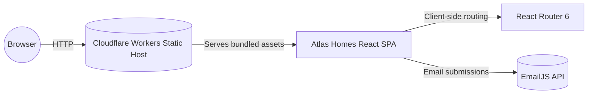
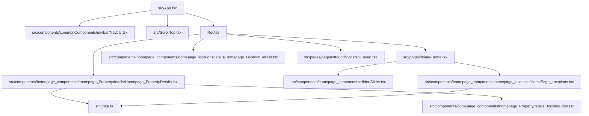

# Architecture

## High-Level System

- The SPA is built with React 18, TypeScript, Vite, and Tailwind CSS utilities bundled through PostCSS.
- Production delivery is configured for Cloudflare Workers via [`wrangler.toml`](wrangler.toml).
- Email capture relies on EmailJS REST calls triggered from booking and contact forms.

## Application Composition

### Routing and Layout
- [`src/App.tsx`](src/App.tsx) wraps the router in a layout that always renders `Navbar`, `ScrollToTop`, and `Footer`, hiding navigation on select deep pages via route checks.
- Routes include:
  - `/` → [`Home`](src/pages/home/Home.tsx)
  - `/property_details/:slug` → [`Homepage_PropertyDetails`](src/components/homepage_components/homepage_Propertydetails/Homepage_PropertyDetails.tsx)
  - `/property_LocationDetails/:id` → [`Homepage_LocationDetails`](src/components/homepage_components/homepage_locationsdetails/Homepage_LocationDetails.tsx)
  - `/*` → 404 catch-all

### Data Flow
- [`src/data.ts`](src/data.ts) exports `propertyData`, `navbarData`, and `footerData`. Components import this module to hydrate cards, galleries, and global chrome.
- Property and location pages derive the slug or ID from `useLocation`/`useNavigate` and lookup the corresponding record inside `propertyData`. Because the dataset ships with the client bundle, no runtime fetch is required.

### State and Side Effects
- `HomePage_Locations` slugifies property names then pushes React Router navigation when a user selects a card, providing `location.state` for downstream usage.
- `Homepage_PropertyDetails` locates the property based on the URL slug and initializes Fancybox galleries within a `useEffect` hook.
- `Homepage_LocationDetails` expects `location.state.property` to include a nested `properties` array when linking from location hubs; fallback messaging is rendered when no entries exist.
- Booking and contact forms (`BookingFrom.tsx`, `ContactUs.tsx`) submit to EmailJS using credentials defined at runtime.

### Styling and Animation
- Tailwind utility classes provide layout primitives, while component-specific CSS (e.g., `Slider.css`, `navbar.css`) styles complex widgets.
- Swiper.js powers carousels on the hero banner and property cards.
- Fancybox handles image lightboxes for property galleries.

### Future Considerations
- Moving `propertyData` to a backend source or CMS would reduce bundle size and enable live pricing.
- Harden navigation between deep-linked pages by falling back to slug-based lookups when `location.state` is missing.
- Replace hard-coded EmailJS identifiers with environment-driven configuration to simplify deployments across environments.
